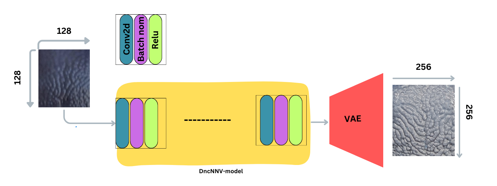
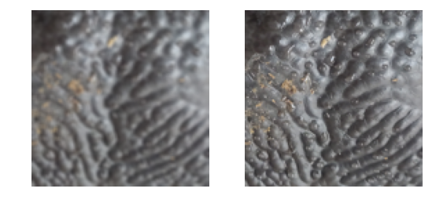
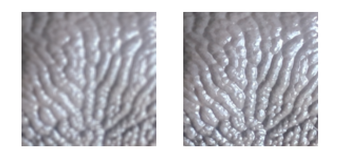

# DNCnn 

## Introduction

This is a PyTorch implementation of DNCnn for image denoising and deblurring. Dncnn is a deep convolutional neural network for image denoising. It is a fully convolutional network with residual learning and batch normalization. The network is trained end-to-end with mean squared error (MSE) loss.

## Requirements

main requirements of this project  is 
1. python >= 3.6 
2. pytorch >= 1.6 (2.0 recommended)
3. torchvision >= 0.7 

please read through the pytorch installation guide [here](https://pytorch.org/get-started/locally/) to install pytorch and torchvision according to your system requirements. 

## Propose model structures 


**Note** : while training the model we have used the same architecture as shown in the above figure. But there are something to keep in mind while using this architecture.

model config contain  up_scale parameter. this parameter is used to scale the image after feeding it to the network. Every up_scale layer will scale the image by 2.Exmple : input --> 64x64x3 image --> after 1st up_scale --> 128x128x3 image --> after 2nd up_scale --> 256x256x3 image.you need to change the transform t2 image size 256,256 to match the output size of the network.


## installation and setup for training 


 1. Clone the repository 
```bash 
git clone <repo url>

```
2. create conda environment 
```bash
conda create -n <env name> python>=3.6 -y

```

3. activate the environment 
```bash
conda activate <env name>

```
4. install the requirements 
```bash
pip install -r requirements.txt

```

5. install the package 
```bash 
pip install -e .

```

## dataset setup 

for this project we have used the BSDS500 dataset for training and testing. The dataset can be downloaded from [here](https://www2.eecs.berkeley.edu/Research/Projects/CS/vision/grouping/resources.html#bsds500). 


dataset images demon 
--> dataset demo image 


  1. create train and val and test folders inside the dataset forlder 
  2. paste the images inside the train and val and test folders accordingly . recommended to create hr inside the train and val and test     folders and paste the images accordingly.

folder structure should be like this 

```bash
dataset 
    |__ train 
    |    |__ hr 
    |    |    |__ 1.png 
    |    |    |__ 2.png 

    |__ val
    |    |__ hr
    |    |    |__ 1.png
    |    |    |__ 2.png

    |__ test
    |    |__ hr
    |    |    |__ 1.png
    |    |    |__ 2.png

```

**Note** : following this structure is not mandatory. you can change the structure according to your needs. but you have to change the paths accordingly in the config file.


## training 

before training you can change the parameters in the config file according to your needs. please chang the directory paths accordingly in the config file.


```bash
cd dncnn/componenets/
python python trainer.py 
    
```

## results

demo training results 

validation loss vs training loss 


demo testing results

## prediction 



